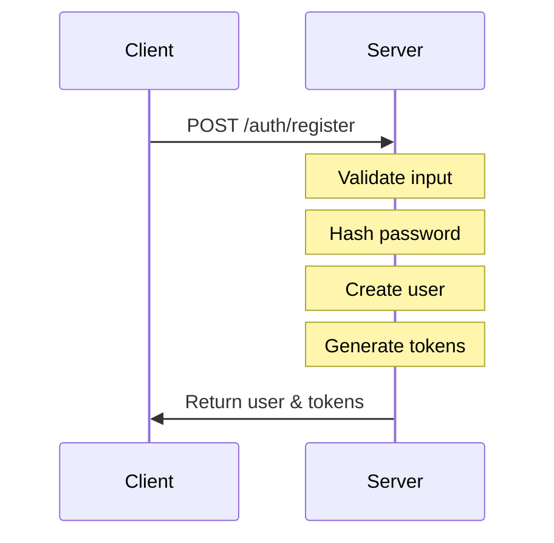
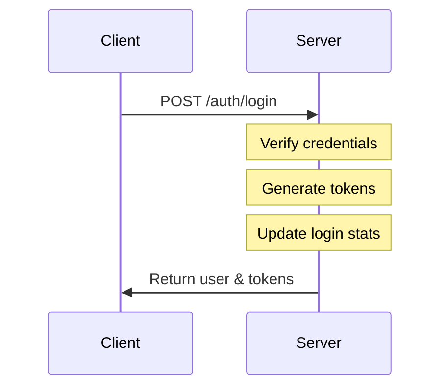
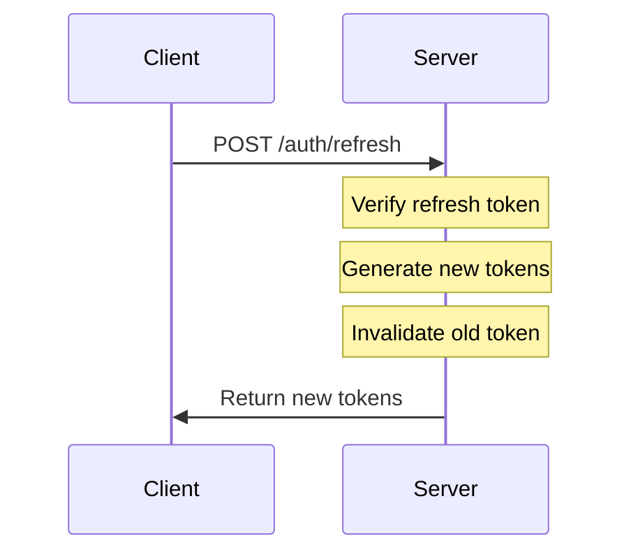
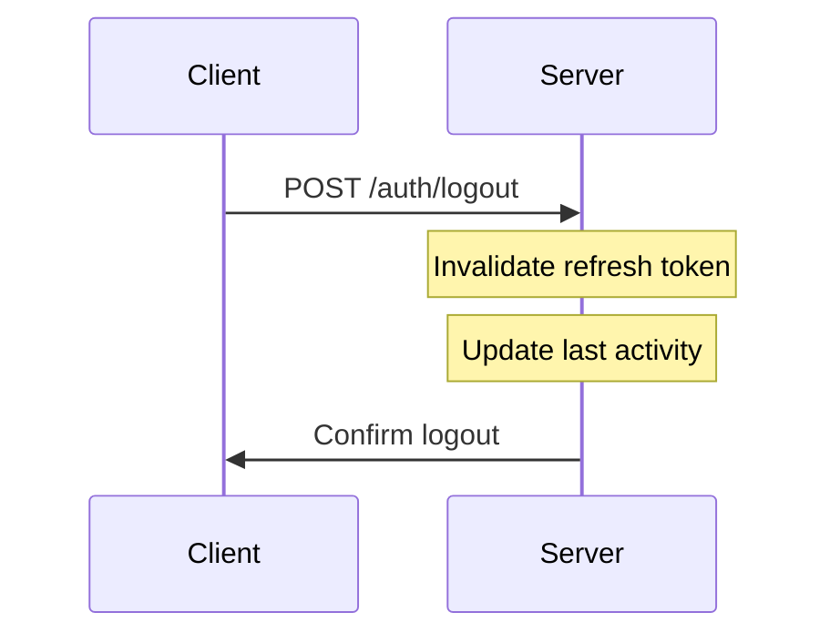

# Authentication System Documentation

> **Security Notice**: This documentation describes general authentication flows and publicly known best practices. No sensitive information, secrets, or implementation-specific vulnerabilities are exposed here. All examples use placeholder values.

## Overview

The authentication system uses JWT (JSON Web Tokens) with a refresh token rotation strategy for secure session management. All sensitive operations are protected by CSRF tokens.

## Key Features

- JWT-based authentication
- Secure password hashing with Argon2id
- Refresh token rotation
- CSRF protection
- Activity tracking
- Session management with automatic expiration

## Security Measures

### Password Security

- Hashed using Argon2id (OWASP recommended)
- Configurable requirements:
  - 8-128 characters
  - Minimum 1 uppercase letter
  - Minimum 1 lowercase letter
  - Minimum 1 number
  - Minimum 1 special character
  - Allowed symbols: !@#$%^&\*()\_+-=[]{}|;:,.<>?

### Token Management

1. **Access Token**

   - Short-lived (15 minutes)
   - Used for API authentication
   - Contains user ID and expiration

2. **Refresh Token**
   - Longer-lived (7 days)
   - Stored in database
   - Rotated on each use
   - Used to obtain new access tokens

### Session Security

- CSRF protection on all mutations (POST, PUT, DELETE)
- Secure HTTP headers
- Token invalidation on logout
- Activity tracking
- Automatic session expiration after 15 minutes of inactivity

## Authentication Flow

### 1. Registration



### 2. Login



### 3. Token Refresh



### 4. Logout



## Database Schema

### Users Table

- Core fields: id, email, hashedPassword, name
- Security fields: refreshToken, refreshTokenExpiresAt, lastTokenInvalidation
- Status fields: emailVerified, isActive, deletedAt
- Activity fields: lastActivityAt, lastSuccessfulLogin, loginCount
- Preference fields: settings, notificationPreferences

## Implementation Details

### Token Generation

```typescript
async function generateTokens(userId: string) {
  const accessToken = await sign(
    { userId, exp: Math.floor(Date.now() / 1000) + 15 * 60 },
    secret
  );

  const refreshToken = await sign(
    {
      userId,
      type: "refresh",
      exp: Math.floor(Date.now() / 1000) + 7 * 24 * 60 * 60,
    },
    secret
  );

  return { accessToken, refreshToken };
}
```

### Password Hashing

```typescript
async function hashPassword(password: string): Promise<string> {
  return argon2.hash(password, {
    type: argon2.argon2id,
    memoryCost: 65536,
    timeCost: 3,
    parallelism: 4,
  });
}
```

## Security Best Practices

1. **Password Storage**

   - Never store plain-text passwords
   - Use Argon2id with proper parameters
   - Enforce strong password policy

2. **Token Security**

   - Short-lived access tokens
   - Refresh token rotation
   - Secure token storage

3. **Request Security**

   - CSRF protection
   - Rate limiting (planned)
   - Input validation

4. **HTTP Security**
   - Secure headers
   - HTTPS in production
   - Cookie security

## Error Handling

Common error scenarios and their responses:

1. Invalid Credentials

```json
{
  "error": "Invalid credentials"
}
```

2. Invalid Token

```json
{
  "error": "Invalid or expired token"
}
```

3. CSRF Error

```json
{
  "error": "Invalid or missing CSRF token"
}
```

## Future Improvements

1. Email verification
2. Password reset flow
3. Multi-factor authentication
4. Rate limiting
5. Account lockout
6. Session management UI
7. Admin dashboard for managing users and sessions
